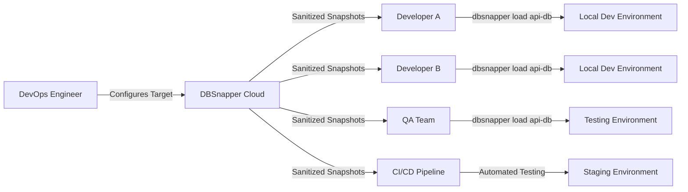

# DBSnapper Cloud: Team Collaboration Platform

When individual developers need realistic data, the local DBSnapper Agent is perfect. But when your **team** needs to collaborate on database snapshots, share sanitized data securely, and integrate with enterprise workflows—that's where DBSnapper Cloud transforms your organization's approach to development data.

## The Team Development Data Challenge

As development teams grow, the database snapshot problem multiplies exponentially:

### **🔄 Coordination Chaos**
- Different team members create inconsistent snapshots 
- QA teams can't reproduce bugs due to data variations
- New developers spend days setting up realistic databases
- Database snapshots become tribal knowledge

### **🔐 Security & Compliance at Scale**
- Sharing database snapshots via Slack or email exposes sensitive data
- No audit trail of who accessed what data when
- Individual sanitization approaches create compliance gaps
- Production access requests create security bottlenecks

### **⚡ Integration Bottlenecks**
- CI/CD pipelines need consistent, up-to-date test data
- Manual snapshot management doesn't scale to multiple environments
- Different cloud storage approaches across teams create silos
- No centralized way to manage database credentials and access

## DBSnapper Cloud: Your Team's Database Snapshot Hub

DBSnapper Cloud extends the security-by-design approach of the DBSnapper Agent to enable seamless team collaboration while maintaining your organization's data sovereignty.

### **🛡️ Security-First Team Collaboration**

**Your Data, Your Infrastructure, Your Control:**
```yaml
# Cloud-managed targets use your own storage
storage_profiles:
  team_s3:
    provider: s3
    bucket: your-company-snapshots  # Your S3 bucket
    awscli_profile: production      # Your AWS credentials

targets:
  production_api:
    snapshot:
      src_url: "postgresql://{{`DB_USER` | env}}:{{`DB_PASS` | env}}@your-db:5432/api"
    storage_profile: team_s3        # Snapshots stored in YOUR infrastructure
    sanitize:
      override_query: "UPDATE users SET email = CONCAT('user', id, '@example.com')"
    sso_groups: ["developers", "qa-team"]  # Access controlled by YOUR SSO
```

**What This Means:**
- **Your databases** stay in your infrastructure
- **Your snapshots** are stored in your cloud storage accounts
- **Your SSO** controls who accesses what data
- **DBSnapper Cloud** only orchestrates—never stores your production data

### **⚡ V3.0 Performance at Scale**

**Multi-Core Operations with Team Coordination:**
```yaml
# Configure optimal performance for your infrastructure
defaults:
  cpus: 4  # Global setting for all team operations

targets:
  large_production_db:
    cpus: 8  # Use more cores for your biggest database
    snapshot:
      src_url: "postgresql://prod-cluster:5432/large_app"
    # Team members inherit these performance optimizations
```

**Benefits:**
- **Faster snapshots** for everyone using multi-core PostgreSQL operations
- **Consistent performance** across team members and CI/CD systems
- **Container-native** operations scale perfectly in Kubernetes environments

### **👥 Enterprise-Grade Team Features**

=== "🔐 **SSO Integration & Access Control**"

    Connect DBSnapper to your existing identity infrastructure:

    ```yaml
    sso:
      okta:
        provider_url: https://your-org.okta.com
        client_id: your-client-id
    
    # Team-based access control
    targets:
      user_database:
        sanitize:
          override_query: "UPDATE users SET ssn = NULL, email = CONCAT('user', id, '@example.com')"
        sso_groups: ["developers", "qa-team"]  # Only these groups can access sanitized snapshots
        
      financial_reports:
        sso_groups: ["senior-developers", "data-team"]  # More restricted access
    ```

=== "📊 **Centralized Management**"

    **Cloud-Based Target Management:**
    - Define database targets once, use everywhere
    - Centralized sanitization rules ensure compliance consistency
    - Team members get automatic access to authorized targets
    - Audit logs track all snapshot access and creation

=== "🤖 **Modern Development Integration**"

    **Seamless Workflow Integration:**
    ```yaml
    # GitHub Actions with cloud-managed targets
    - uses: dbsnapper/install-dbsnapper-agent-action@v1
    - run: |
        # Use cloud-configured target with team storage
        dbsnapper build production-api --sanitize
        dbsnapper load production-api latest
    ```
    
    **Available Integrations:**
    - **VS Code Extension** - Access cloud targets directly from your editor
    - **GitHub Actions** - Automated snapshots with team-shared storage
    - **Terraform Provider** - Infrastructure as Code for database snapshot management
    - **MCP Server** - AI assistant integration with cloud targets

## Real-World Team Workflows

### **Development Team Workflow**



1. **DevOps Engineer** creates production target with sanitization rules
2. **Developers** instantly access latest sanitized snapshots: `dbsnapper load production-api`
3. **QA Team** gets consistent test data for reliable bug reproduction
4. **CI/CD Pipelines** automatically use up-to-date snapshots for integration tests

### **Enterprise Security Workflow**

- **Production data** never leaves your approved infrastructure
- **Sanitized snapshots** are automatically shared with authorized team members
- **SSO groups** control access (developers get basic access, senior developers get additional targets)
- **Audit logs** provide compliance evidence for security reviews

## Cloud vs. Local: Choose Your Approach

| Capability | Local Agent Only | + DBSnapper Cloud |
|------------|------------------|-------------------|
| **Individual Development** | Perfect ✅ | Perfect ✅ |
| **Team Snapshot Sharing** | Manual process | Automatic ✅ |
| **Consistent Sanitization** | Per-developer setup | Centralized rules ✅ |
| **SSO Integration** | Not available | Full integration ✅ |
| **Audit & Compliance** | Local logs only | Enterprise audit trails ✅ |
| **CI/CD Integration** | Manual configuration | Seamless automation ✅ |
| **Cross-Team Access** | Not available | Group-based permissions ✅ |

## Getting Started with Your Team

### **Quick Setup Path**

```bash
# 1. Individual developers already using DBSnapper Agent
dbsnapper config init

# 2. DevOps engineer configures team targets in DBSnapper Cloud
#    (Web interface - no additional CLI installation required)

# 3. Team members automatically get access to cloud-managed targets
dbsnapper targets  # Now shows both local AND cloud targets
dbsnapper build production-api --sanitize  # Uses team storage and sanitization rules
```

### **Implementation Steps**

1. **[Sign up for DBSnapper Cloud](https://app.dbsnapper.com/sign_up)** - Free trial available
2. **[Configure Storage Profiles](storage_profiles.md)** - Connect your existing cloud storage  
3. **[Set up Database Targets](targets.md)** - Define your production databases with sanitization
4. **[Enable SSO Integration](sso/index.md)** - Connect your identity provider (optional but recommended)
5. **[Implement Team Workflows](team-workflows.md)** - End-to-end workflows for DevOps, developers, QA, and compliance teams
6. **Team members continue using existing DBSnapper Agent** - Cloud targets appear automatically

## Your Data, Your Infrastructure, Our Orchestration

**DBSnapper Cloud Approach:**
- **Processing**: Happens in your infrastructure (via DBSnapper Agent)
- **Storage**: Uses your cloud storage accounts (S3, R2, etc.)
- **Access Control**: Integrates with your SSO (Okta, Auth0, etc.)
- **Data Security**: Your production data never leaves your environment

**What DBSnapper Cloud Provides:**
- Target configuration management and team sharing
- SSO integration and group-based access control  
- Audit logging and compliance reporting
- Seamless integration with development tools

---

Ready to scale your database snapshot workflow across your entire team? **[Configure your first storage profile](storage_profiles.md)** to get started.
