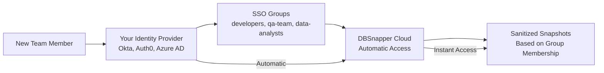

# Single Sign-On: Enterprise Team Authentication

Transform your database snapshot workflow from individual access to **secure, organization-wide collaboration**. DBSnapper's SSO integration connects with your existing identity infrastructure to provide automatic team provisioning, group-based access control, and enterprise-grade security for database snapshots.

## The Enterprise Access Challenge

As your development team grows, managing database snapshot access becomes complex:

### **🔐 Individual Account Chaos**
- Manual user provisioning for each team member
- No centralized control over who accesses what data
- Difficult to onboard/offboard team members
- Password management and security becomes a burden

### **🚫 Security & Compliance Gaps**  
- No audit trail of who accessed sensitive database snapshots
- Different access levels across team members are hard to manage
- Compliance teams can't easily review data access patterns
- Potential data exposure when team members leave

### **⚡ Operational Bottlenecks**
- IT teams become bottlenecks for database access requests
- Developers wait for manual provisioning before they can work
- No automated way to share snapshots based on project teams
- Mixed access patterns create security vulnerabilities

## DBSnapper SSO: Your Identity Infrastructure, Extended

DBSnapper's SSO integration seamlessly extends your existing identity management to cover database snapshot access—no additional user management required.

### **🎯 Automatic Team Provisioning**

**Leverage Your Existing Identity Provider:**



**What This Means:**
- **New hires** get database access automatically based on their team assignment
- **Departing employees** lose access immediately when deactivated in your identity system
- **Project teams** are provisioned database access based on SSO group membership
- **Zero manual provisioning** by IT teams for database snapshot access

### **🛡️ Group-Based Snapshot Sharing**

**Secure, intelligent access control using your organizational structure:**

```yaml
# Target configuration with SSO group sharing
targets:
  production_users_api:
    snapshot:
      src_url: "postgresql://readonly@prod-cluster:5432/users_api"
    storage_profile: production_s3
    sanitize:
      storage_profile: team_sanitized_s3
      override_query: |
        -- GDPR-compliant sanitization
        UPDATE users SET 
          email = CONCAT('user', id, '@example.com'),
          ssn = NULL, phone = '555-0000';
    # Only these SSO groups can access sanitized snapshots
    sso_groups: ["backend-developers", "qa-engineers"]

  financial_reports:  
    # More sensitive data - restricted access
    sso_groups: ["senior-developers", "finance-team", "compliance-auditors"]
    
  reference_data:
    # Broadly shared reference data
    sso_groups: ["all-engineering", "product-managers", "customer-support"]
```

**Access Control Benefits:**
- **Automatic sharing** - Sanitized snapshots shared with authorized groups instantly
- **Granular permissions** - Different data sensitivity levels for different teams
- **Organizational alignment** - Access control follows your company structure
- **Audit compliance** - Complete trail of group-based access decisions

### **🔍 Enterprise Audit & Compliance**

**Complete visibility into database snapshot access:**

=== "**🏢 Compliance Ready**"

    **Built-in audit capabilities for enterprise requirements:**
    - **Who accessed what snapshots when** - Complete access logging
    - **Group membership changes** - Tracked through your identity provider
    - **Data sanitization verification** - Proof that PII was removed before sharing
    - **Cross-system audit trails** - Integration with your existing security monitoring

=== "**📊 Security Monitoring**"

    **Integration with your existing security infrastructure:**
    ```yaml
    # Security monitoring integration points:
    # - SSO login events logged in your identity provider
    # - DBSnapper access events logged in DBSnapper Cloud
    # - Cloud storage access events logged in your storage provider
    # - Complete audit trail across all systems
    ```

=== "**🎯 Automated Compliance**"

    **Compliance workflows that work with your existing processes:**
    - **Quarterly access reviews** - Automated reports of who has access to what data
    - **Data retention policies** - Automatic cleanup based on your organizational policies  
    - **Incident response** - Immediate access revocation through your identity provider
    - **Compliance evidence** - Automated collection of access and sanitization proof

## Supported Identity Providers

DBSnapper integrates with enterprise identity providers using **OpenID Connect (OIDC)** protocols:

=== "**✅ Currently Supported**"

    **Okta**
    : Full integration including group membership sync, automatic provisioning, and audit logging
    : **[Complete setup guide →](sso-okta-oidc.md)**
    
    **Additional Providers**
    : We're actively adding support for more enterprise identity providers
    : **Contact us** if you need a specific provider prioritized

=== "**🚀 Enterprise Integration Process**"

    **For organizations with other identity providers:**
    
    1. **Assessment** - We review your identity infrastructure requirements
    2. **Integration Planning** - Custom integration development if needed  
    3. **Testing & Validation** - Comprehensive security and functionality testing
    4. **Production Deployment** - Guided rollout with your security team
    5. **Ongoing Support** - Enterprise support for identity integration issues

## Real-World SSO Workflows

### **👨‍💼 IT Administrator: SSO Setup**

```yaml
# 1. Configure SSO in DBSnapper Cloud
sso:
  okta:
    provider_url: https://yourcompany.okta.com
    client_id: dbsnapper-production-client
    # Groups automatically synced from your identity provider

# 2. Define group-based target access
targets:
  prod_api_database:
    sso_groups: ["backend-developers", "senior-engineers"]
    sanitize:
      sso_groups: ["backend-developers", "qa-engineers", "data-analysts"]
      
  staging_api_database:
    sso_groups: ["all-developers", "qa-engineers"]
```

### **👩‍💻 New Developer: Automatic Access**

```bash
# Day 1: New developer joins the team

# 1. IT adds them to "backend-developers" group in Okta
# 2. They sign into DBSnapper Cloud using SSO
# 3. Automatically get access to authorized targets

dbsnapper targets
# Shows: prod_api_database, staging_api_database (based on group membership)

dbsnapper load prod_api_database
# Loads latest sanitized snapshot - no manual provisioning required
```

### **👨‍💼 Security Team: Compliance Audit**

```bash
# Quarterly access review workflow:

# 1. Review SSO group membership in your identity provider
# 2. Review target access permissions in DBSnapper Cloud  
# 3. Automated audit reports show:
#    - Who accessed which snapshots when
#    - What sanitization was applied  
#    - Which SSO groups had access to what data
#    - Complete audit trail for compliance evidence
```

## SSO Configuration Benefits

### **🚀 Operational Efficiency**

**Eliminate IT bottlenecks:**
- **Zero manual provisioning** for database snapshot access
- **Automatic onboarding** for new team members
- **Instant offboarding** when team members leave
- **Self-service access** based on organizational group membership

### **🔒 Enhanced Security**

**Enterprise-grade security controls:**
- **Centralized authentication** through your existing identity provider
- **Multi-factor authentication** inherited from your SSO configuration
- **Session management** controlled by your organizational policies
- **Immediate access revocation** through your identity systems

### **📋 Compliance & Audit**

**Built for enterprise compliance requirements:**
- **Complete audit trails** across all systems
- **Automated access reviews** with group-based reporting
- **Data sanitization verification** for privacy compliance
- **Integration with existing security monitoring** tools

## Getting Started with SSO

### **⚡ Quick Setup Process**

1. **[Configure Okta Integration](sso-okta-oidc.md)** - Complete step-by-step setup guide
2. **Define SSO Groups** - Map your organizational structure to database access
3. **Configure Target Sharing** - Set up group-based access for your database targets  
4. **Test & Validate** - Verify team members get appropriate access
5. **Roll Out to Team** - Seamless transition from individual to group-based access

### **🎯 Implementation Strategy**

=== "**Start Small**"
    
    Begin with a single team and one database target:
    ```yaml
    targets:
      staging_api:
        sso_groups: ["backend-team-pilot"]
        # Test with staging data first
    ```

=== "**Scale Gradually**" 

    Add more teams and production targets:
    ```yaml
    targets:
      production_api:
        sso_groups: ["backend-developers"]  # Expanded access
        
      analytics_warehouse:  
        sso_groups: ["data-team", "analysts"]  # New team type
    ```

=== "**Full Deployment**"

    Complete organizational rollout:
    ```yaml
    # Multi-environment, multi-team access control
    targets:
      prod_users_api:
        sso_groups: ["senior-developers", "devops-team"]
      prod_orders_api:  
        sso_groups: ["backend-developers", "qa-engineers"]
      reference_data:
        sso_groups: ["all-engineering", "product-managers"]
    ```

## Advanced SSO Features

### **🎛️ Dynamic Group Membership**

**Access automatically adjusts with organizational changes:**
- **Project team assignments** - Access follows project team membership
- **Role promotions** - Senior developers get additional target access
- **Department transfers** - Access rights change with organizational moves
- **Temporary assignments** - Consultants get limited, time-bound access

### **🔍 Integration Monitoring**

**Monitor SSO integration health:**
```bash
# DBSnapper provides monitoring for:
# - SSO authentication success/failure rates
# - Group membership sync status
# - Target access pattern analysis  
# - Integration performance metrics
```

### **🚨 Security Alerts**

**Automated security monitoring:**
- **Unusual access patterns** - Detection of abnormal snapshot access
- **Group membership changes** - Alerts for sensitive group modifications
- **Failed authentication attempts** - Integration with your security monitoring
- **Compliance violations** - Automatic detection of policy violations

---

**Ready to enable secure team collaboration?** Start with our **[Okta integration guide](sso-okta-oidc.md)** to connect your identity provider with DBSnapper Cloud.

**Need complete implementation workflows?** Our **[Team Workflows guide](../team-workflows.md)** provides end-to-end processes showing how SSO integration enables DevOps setup, developer productivity, QA testing, and compliance workflows.

**Need a different identity provider?** [Contact our enterprise team](mailto:enterprise@dbsnapper.com) to discuss custom integration options for your organization.
