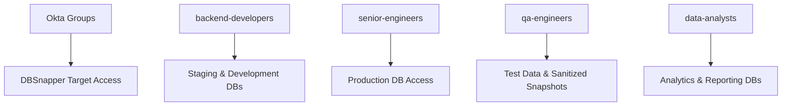
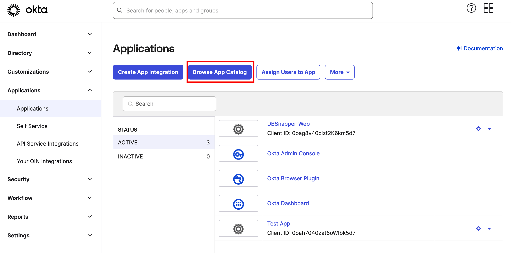

# Okta SSO Integration: Complete Setup Guide

Transform your team's database snapshot access with secure, automated Okta integration. This guide walks you through connecting your Okta organization with DBSnapper Cloud to enable automatic team provisioning, group-based access control, and enterprise-grade audit capabilities.

## Integration Overview

### **🛡️ Enterprise-Grade Security Features**

**Fully Supported Okta Capabilities:**
- **Service Provider (SP) Initiated Authentication** - Users authenticate via DBSnapper Cloud
- **OpenID Connect (OIDC)** - Modern, secure authentication protocol
- **Proof Key for Code Exchange (PKCE)** - Enhanced security for authentication flows
- **Just-in-Time (JIT) Provisioning** - Automatic account creation on first login
- **Group Membership Sync** - Real-time access control based on Okta groups
- **Multi-Factor Authentication (MFA)** - Inherited from your Okta security policies

### **🎯 What You'll Achieve**

**After completing this setup:**
- **New team members** get database access automatically when added to Okta groups
- **Existing team members** log in with their corporate credentials
- **Access control** is managed through your existing Okta group structure
- **Departing employees** lose access immediately when deactivated in Okta
- **Audit compliance** is automatically maintained across both systems

## Prerequisites & Planning

### **📋 Before You Begin**

**Required Access:**
- **Okta Administrator** privileges in your organization
- **DBSnapper Cloud Administrator** access for your organization
- **IT Security Review** (recommended for production deployments)

**Planning Checklist:**
- [ ] Identify which Okta groups should access DBSnapper
- [ ] Define access levels (developers, QA, senior engineers, etc.)
- [ ] Review your organization's SSO security policies
- [ ] Plan user communication for the SSO rollout

### **🎯 Group Mapping Strategy**

**Plan your Okta group to DBSnapper access mapping:**



## Step 1: Configure DBSnapper Application in Okta

### **1.1 Add DBSnapper from the Okta Integration Network**

1. **Sign into your Okta Admin Console**
2. **Navigate to Applications → Browse App Catalog**
3. **Search for "DBSnapper"** in the catalog



4. **Click "Add Integration"** for the DBSnapper application


### **1.2 Configure Application Settings**

**Basic Application Configuration:**

1. **Application Name** - Leave as "DBSnapper" or customize for your organization
2. **Application Logo** - DBSnapper logo is included automatically
3. **Application Visibility** - Configure based on your rollout strategy

**Important Security Settings:**

- **Sign-On Policy** - Configure according to your organization's security requirements
- **MFA Requirements** - Inherit from your organization's global MFA policies  
- **Session Policies** - Use your existing Okta session management rules

### **1.3 Collect Integration Credentials**

**Record these values for DBSnapper Cloud configuration:**

=== "**📋 Required Information**"

    **Client ID**
    : Public identifier for the DBSnapper application in your Okta org
    : Example: `0oag95e2z5BhLZ5AI5d7`
    
    **Client Secret**  
    : Private secret for secure authentication (click "Reveal" to see)
    : Example: `abcdef123456...` (keep this secure!)
    
    **Okta Domain**
    : Your organization's Okta URL
    : Example: `https://yourcompany.okta.com`

=== "**🔒 Security Notes**"

    **Client Secret Security:**
    - Store the client secret securely (password manager recommended)
    - Only share with authorized DBSnapper administrators  
    - Rotate regularly according to your security policies
    - Never commit to source control or share via insecure channels
    
    **Access Validation:**
    - Test the integration with a small group first
    - Verify group membership sync works correctly
    - Confirm MFA requirements are enforced

## Step 2: Configure DBSnapper Cloud SSO Integration

### **2.1 Access SSO Configuration**

1. **Sign into DBSnapper Cloud** with your administrator account
2. **Navigate to Settings → SSO** from the main menu
3. **Click "Add SSO Tenant"** to begin configuration

### **2.2 Configure SSO Tenant Settings**

**Enter the Okta integration details you collected from Step 1:**


=== "**🔧 Configuration Fields**"

    **Provider**
    : Select "Okta - OIDC" from the dropdown
    
    **Client ID**  
    : Enter the Client ID from your Okta DBSnapper application
    : Example: `0oag95e2z5BhLZ5AI5d7`
    
    **Client Secret**
    : Enter the Client Secret from your Okta DBSnapper application  
    : This will be encrypted and stored securely
    
    **Issuer URL**
    : Your Okta domain URL
    : Example: `https://yourcompany.okta.com`
    
    **Organization Domain**
    : Your company's email domain (pre-filled)
    : Example: `yourcompany.com`
    : Must match your users' email domains for automatic user mapping

=== "**🔍 Validation Steps**"

    **Before clicking Save:**
    - [ ] Client ID matches exactly from Okta
    - [ ] Client Secret was copied correctly (no extra spaces)
    - [ ] Issuer URL is your exact Okta domain
    - [ ] Organization Domain matches your team's email addresses
    - [ ] All fields are filled in completely

### **2.3 Complete Integration Setup**

1. **Click "Save"** to create the SSO tenant
2. **Verify the configuration** appears correctly


**Configuration Complete!** Your Okta SSO integration is now active.

## Step 3: Configure Group-Based Access Control  

### **3.1 Set Up Okta Groups**

**In your Okta Admin Console:**

1. **Navigate to Directory → Groups**
2. **Create or identify groups** for DBSnapper access:

```text
Recommended Group Structure:
├── dbsnapper-developers        # Basic development database access
├── dbsnapper-senior-engineers  # Production database access  
├── dbsnapper-qa-engineers      # Testing and QA database access
├── dbsnapper-data-analysts     # Analytics and reporting access
└── dbsnapper-admins           # Full administrative access
```

3. **Add users to appropriate groups** based on their roles and access needs

### **3.2 Configure Target Access in DBSnapper**

**Map your Okta groups to database targets:**

```yaml
# Example target configuration with group-based access
targets:
  production_api:
    snapshot:
      src_url: "postgresql://readonly@prod-cluster:5432/api"
    storage_profile: prod_s3
    sanitize:
      storage_profile: sanitized_s3  
      override_query: |
        UPDATE users SET 
          email = CONCAT('user', id, '@example.com'),
          ssn = NULL;
    # Only these Okta groups can access sanitized snapshots  
    sso_groups: ["dbsnapper-developers", "dbsnapper-qa-engineers"]

  sensitive_financial:
    # More restrictive access for sensitive data
    sso_groups: ["dbsnapper-senior-engineers", "dbsnapper-data-analysts"]
    
  reference_data:  
    # Broadly accessible reference data
    sso_groups: ["dbsnapper-developers", "dbsnapper-qa-engineers", "dbsnapper-data-analysts"]
```

## Step 4: Test & Validate Integration

### **4.1 Test Authentication Flow**

**Verify the complete authentication process:**

1. **Visit DBSnapper Cloud sign-in page**: [app.dbsnapper.com/sign_in](https://app.dbsnapper.com/sign_in)
2. **Enter your corporate email address** (must match Organization Domain)
3. **Click "Next"** 
4. **Click "Sign in with SSO"** button
5. **You should be redirected to Okta** for authentication
6. **Complete Okta authentication** (including MFA if required)
7. **You should be redirected back to DBSnapper Cloud** and automatically logged in

### **4.2 Verify Group Access**

**Test that group membership controls access correctly:**

=== "**👨‍💻 Developer Test**"

    ```bash
    # User in "dbsnapper-developers" group should see:
    dbsnapper targets
    # Output should show targets with sso_groups: ["dbsnapper-developers"]
    
    dbsnapper load production_api
    # Should successfully load sanitized snapshot
    ```

=== "**👨‍💼 Admin Test**"

    ```bash
    # User in "dbsnapper-admins" group should see:
    dbsnapper targets  
    # Output should show all targets they have access to
    
    # Should be able to create new targets via DBSnapper Cloud interface
    ```

=== "**🚫 Access Restriction Test**"

    ```bash
    # User NOT in required SSO groups should:
    dbsnapper targets
    # NOT see restricted targets
    
    dbsnapper load sensitive_financial
    # Should receive "Access Denied" error
    ```

### **4.3 Monitor Integration Health**

**Set up monitoring for ongoing operations:**

- **Okta Admin Console** - Monitor DBSnapper application usage and authentication events
- **DBSnapper Cloud Audit Logs** - Track user access patterns and snapshot usage
- **Group Membership Changes** - Set up alerts for sensitive group modifications
- **Failed Authentication Events** - Monitor for potential security issues

## Step 5: Team Rollout & Training

### **5.1 Pilot Deployment**

**Start with a small group for testing:**

1. **Select 3-5 team members** for initial testing
2. **Add them to appropriate Okta groups**  
3. **Walk them through the SSO login process**
4. **Verify they can access expected database targets**
5. **Collect feedback** on the user experience

### **5.2 Full Team Rollout**

**After successful pilot testing:**

=== "**📢 Communication Plan**"

    **Email template for team notification:**
    
    ```text
    Subject: Database Snapshots - Now Available via SSO
    
    Team,
    
    We've enabled SSO access for database snapshots through DBSnapper Cloud.
    
    What's Changed:
    • Log in using your corporate credentials at app.dbsnapper.com
    • Access to database snapshots is now controlled by your team membership
    • No more separate passwords to manage
    
    Getting Started:
    1. Visit app.dbsnapper.com/sign_in
    2. Enter your @yourcompany.com email address  
    3. Click "Sign in with SSO"
    4. Use your existing corporate credentials
    
    Questions? Contact: [your IT team]
    ```

=== "**🎯 Success Metrics**"

    **Track rollout success:**
    - [ ] All team members can authenticate successfully
    - [ ] Users can access expected database targets  
    - [ ] No one has access to unauthorized targets
    - [ ] MFA requirements are enforced correctly
    - [ ] Audit logging captures all access events

## Troubleshooting & Support

### **🚨 Common Issues**

=== "**Authentication Failures**"

    **"Invalid client credentials" error:**
    - Verify Client ID and Client Secret are correct
    - Check that Client Secret doesn't have extra spaces
    - Confirm Okta application is active and assigned to users
    
    **"User not found" error:**
    - Verify Organization Domain matches user email domains
    - Check that user exists in Okta and has access to DBSnapper app
    - Confirm user is in at least one DBSnapper-related group

=== "**Access Control Issues**"

    **User can't see expected targets:**
    - Verify user is in the correct Okta groups
    - Check that target configuration includes user's groups in `sso_groups`
    - Confirm group names match exactly (case sensitive)
    
    **User sees too many targets:**
    - Review group membership in Okta
    - Check target configurations for overly broad `sso_groups`
    - Verify principle of least privilege is followed

=== "**Integration Health**"

    **Group sync not working:**
    - Check Okta group membership updates are propagating
    - Verify DBSnapper can read group information from Okta
    - Contact support if sync appears delayed or broken

### **🔧 Validation Commands**

```bash
# Test SSO authentication and group access
dbsnapper auth whoami  # Shows current user and group memberships

# List available targets (filtered by group membership)
dbsnapper targets

# Test target access
dbsnapper config check --target your_target_name

# Debug authentication issues
DBSNAPPER_DEBUG=true dbsnapper auth whoami
```

### **📞 Getting Help**

**Enterprise Support:**
- **Email**: [enterprise@dbsnapper.com](mailto:enterprise@dbsnapper.com)
- **Priority Support**: Available for enterprise customers
- **Documentation**: Additional guides at [docs.dbsnapper.com](https://docs.dbsnapper.com)

**Community Support:**
- **GitHub Issues**: [github.com/dbsnapper/dbsnapper/issues](https://github.com/dbsnapper/dbsnapper/issues)
- **Community Forum**: [community.dbsnapper.com](https://community.dbsnapper.com)

---

## Summary: You're Ready for Enterprise-Scale Database Snapshots

🎉 **Congratulations!** You've successfully configured enterprise-grade database snapshot access with:

- **✅ Secure SSO Authentication** - Team members use corporate credentials
- **✅ Automated Access Control** - Group membership determines database access  
- **✅ Compliance-Ready Auditing** - Complete access trails for security reviews
- **✅ Scalable Team Management** - New hires get automatic access, departing employees lose access immediately

**Next Steps:**
- **[Configure additional database targets](../targets.md)** with appropriate group access
- **[Set up cloud storage profiles](../storage_profiles.md)** for team snapshot sharing
- **[Explore advanced sanitization](../../sanitize/introduction.md)** for compliance requirements

Your team now has secure, scalable access to realistic database snapshots for development, testing, and analysis—all managed through your existing identity infrastructure.
