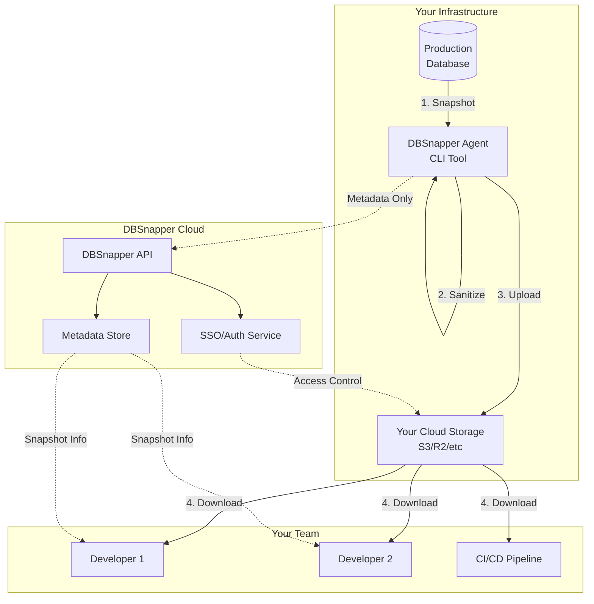
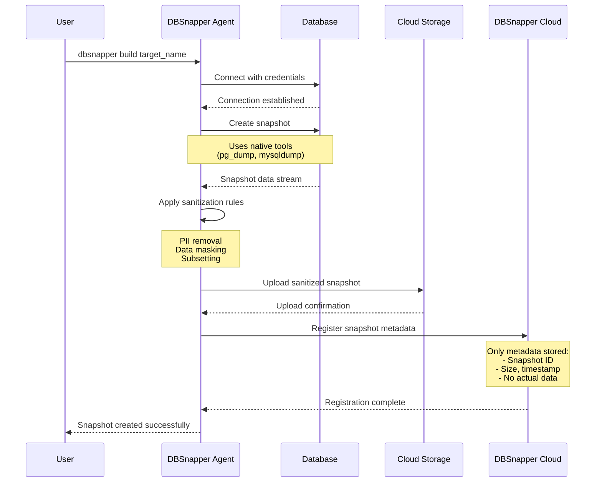
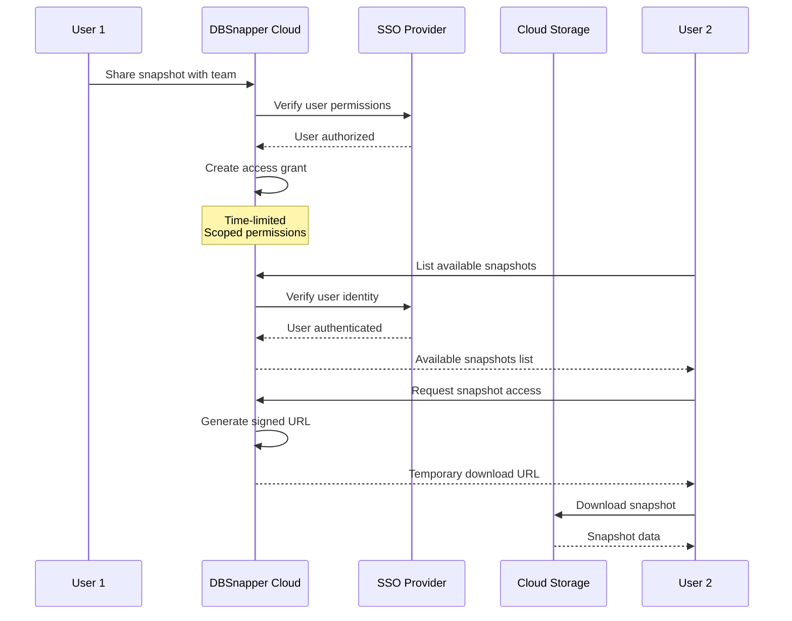
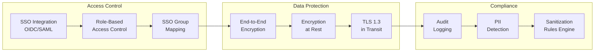
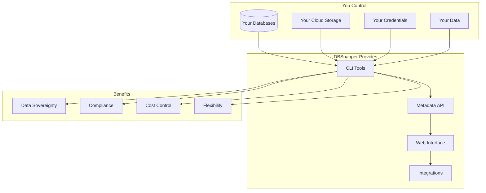
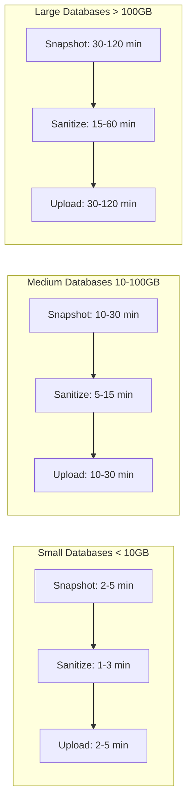
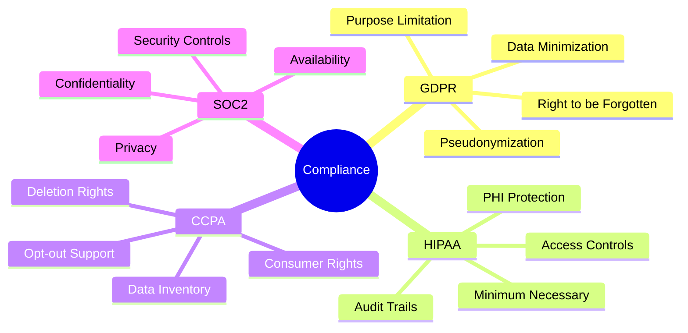

# How DBSnapper Works

## Technical Architecture Overview

DBSnapper is built on a **bring-your-own-infrastructure (BYOI)** model that ensures your sensitive data never leaves your control. The architecture consists of three main components working together to provide secure, efficient database snapshot management.



### Key Architectural Principles

1. **Data Sovereignty**: Your database snapshots never pass through DBSnapper servers
2. **Zero Trust Security**: All operations are authenticated and authorized
3. **Ephemeral Processing**: No persistent storage of sensitive data during operations
4. **Cloud-Native Design**: Built for modern cloud infrastructure and DevOps workflows

## Detailed Data Flow

### 1. Snapshot Creation Process



### 2. Snapshot Sharing Workflow



## Security Model

### Multi-Layer Security Architecture



### Security Features

1. **Authentication & Authorization**
   - SSO integration (Okta, Azure AD, Google Workspace)
   - Multi-factor authentication support
   - API key management for CI/CD

2. **Data Protection**
   - Client-side encryption before upload
   - Server-side encryption in cloud storage
   - TLS 1.3 for all data transfers

3. **Access Control**
   - Temporary, signed URLs for downloads
   - IP allowlisting
   - Time-based access expiration

4. **Compliance**
   - GDPR-compliant data handling
   - HIPAA-ready sanitization rules
   - SOC 2 Type II practices

## Comparison with Traditional Backup Methods

| Feature | DBSnapper | pg_dump/mysqldump | Custom Scripts | Backup Services |
|---------|-----------|-------------------|----------------|-----------------|
| **Sanitization** | ✅ Built-in, configurable | ❌ Manual post-processing | ⚠️ Varies | ❌ Not included |
| **Subsetting** | ✅ Intelligent, relational | ❌ All or nothing | ⚠️ Complex to implement | ❌ Full backups only |
| **Team Sharing** | ✅ SSO-integrated | ❌ Manual file sharing | ❌ DIY solution | ⚠️ Limited |
| **Automation** | ✅ CI/CD ready | ⚠️ Basic scripting | ⚠️ Custom development | ✅ Some support |
| **Storage Flexibility** | ✅ Any S3-compatible | ❌ Local files | ⚠️ Depends on script | ❌ Vendor lock-in |
| **Compliance Tools** | ✅ GDPR/HIPAA ready | ❌ None | ❌ None | ⚠️ Limited |
| **Performance** | ✅ Optimized streaming | ✅ Native speed | ⚠️ Varies | ✅ Optimized |
| **Version Control** | ✅ Snapshot versioning | ❌ Manual | ❌ Manual | ✅ Some support |

## Bring Your Own Infrastructure Model

### How BYOI Works



### BYOI Benefits

1. **Data Sovereignty**
   - Your data never touches DBSnapper servers
   - Complete control over data residency
   - Meet regulatory requirements

2. **Cost Optimization**
   - Use existing cloud storage contracts
   - Leverage reserved capacity
   - No data egress fees to DBSnapper

3. **Security Compliance**
   - Maintain existing security policies
   - Use your encryption keys
   - Integrate with your security tools

4. **Infrastructure Flexibility**
   - Any S3-compatible storage
   - On-premises or cloud databases
   - Hybrid cloud support

## Performance Characteristics

### Snapshot Performance Metrics



### Performance Optimization Features

1. **Streaming Architecture**
   - Process data without full disk writes
   - Reduced I/O overhead
   - Memory-efficient operations

2. **Parallel Processing**
   - Multi-threaded sanitization
   - Concurrent upload streams
   - Parallel table processing

3. **Incremental Snapshots**
   - Only capture changes
   - Reduce snapshot time
   - Lower storage costs

4. **Compression**
   - Automatic compression
   - Multiple algorithm support
   - Bandwidth optimization

## Compliance and Regulatory Considerations

### Data Protection Compliance



### Compliance Features

1. **GDPR Compliance**
   - Automated PII detection and removal
   - Configurable retention policies
   - Data portability support
   - Right to erasure implementation

2. **HIPAA Compliance**
   - PHI sanitization rules
   - Access logging and audit trails
   - Encryption in transit and at rest
   - Business Associate Agreement (BAA) ready

3. **Industry Standards**
   - PCI DSS card data masking
   - Financial data protection
   - Government security requirements
   - Custom compliance rules

## Integration Ecosystem

### Native Integrations

```mermaid
graph TD
    DBS[DBSnapper Core]
    
    subgraph "Development Tools"
        VSC[VSCode Extension]
        GHA[GitHub Actions]
        GL[GitLab CI]
        JNK[Jenkins]
    end
    
    subgraph "Infrastructure"
        TF[Terraform Provider]
        K8S[Kubernetes Operator]
        HELM[Helm Charts]
        ANS[Ansible Playbooks]
    end
    
    subgraph "Databases"
        PG[PostgreSQL]
        MY[MySQL]
        MS[SQL Server Beta]
        MG[MongoDB Soon]
    end
    
    subgraph "Storage"
        S3[Amazon S3]
        R2[Cloudflare R2]
        GCS[Google Cloud Storage]
        AZ[Azure Blob]
    end
    
    DBS --> Development Tools
    DBS --> Infrastructure
    DBS --> Databases
    DBS --> Storage
```

## Getting Started

Ready to implement DBSnapper in your workflow? Here's your path forward:

1. **[Install DBSnapper Agent](installation.md)** - Get the CLI tool running
2. **[Configure Your First Target](quick-start.md)** - Connect to your database
3. **[Create a Snapshot](snapshot/introduction.md)** - Build your first snapshot
4. **[Set Up Sanitization](sanitize/introduction.md)** - Remove sensitive data
5. **[Share with Your Team](share/introduction.md)** - Collaborate securely

For enterprise deployments, explore [DBSnapper Cloud](dbsnapper-cloud/introduction.md) for advanced team features and SSO integration.