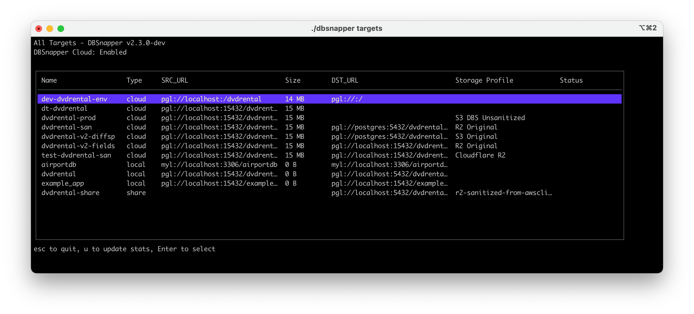

# DBSnapper Agent Installation

The DBSnapper Agent is the core CLI tool that powers all database snapshot operations. Available for macOS, Linux, and Windows (via WSL2), it can be installed in minutes using your preferred method.

<p class="img-box">
  
  <br/>
  <small>DBSnapper Agent User Interface</small>
</p>

## System Requirements

### Minimum Requirements

| Component | Requirement | Notes |
|-----------|-------------|-------|
| **Operating System** | macOS 10.15+, Linux (64-bit), Windows 10+ with WSL2 | Native Windows support coming soon |
| **CPU** | x86_64 or ARM64 | Apple Silicon (M1/M2/M3) fully supported |
| **Memory** | 512MB RAM minimum | 2GB+ recommended for large databases |
| **Disk Space** | 100MB for agent | Plus 2x your largest database size for operations |
| **Network** | Outbound HTTPS (443) | For DBSnapper Cloud features (optional) |

### Database Requirements

| Database | Minimum Version | Required Tools |
|----------|-----------------|----------------|
| **PostgreSQL** | 9.6+ | `psql`, `pg_dump`, `pg_restore` |
| **MySQL** | 5.7+ | `mysql`, `mysqldump` |

### Optional Dependencies

- **Docker**: For containerized database operations
- **Cloud CLI Tools**: AWS CLI, gcloud, or az CLI for respective storage providers
- **Git**: For version-controlled configuration management

## Quick Install

### macOS (Homebrew) - Recommended

```bash
# Install via Homebrew
brew install dbsnapper/tap/dbsnapper

# Verify installation
dbsnapper --version
```

### Linux (Script Install)

```bash
# Download and install latest version
curl -sSL https://get.dbsnapper.com | sh

# Or specify a version
curl -sSL https://get.dbsnapper.com | sh -s -- --version 2.0.3

# Verify installation
dbsnapper --version
```

### Docker

```bash
# Pull latest image
docker pull ghcr.io/dbsnapper/dbsnapper:latest

# Run interactively
docker run -it --rm \
  -v ~/.config/dbsnapper:/root/.config/dbsnapper \
  -v $(pwd):/workspace \
  ghcr.io/dbsnapper/dbsnapper:latest /bin/bash

# Or run a command directly
docker run --rm \
  -v ~/.config/dbsnapper:/root/.config/dbsnapper \
  ghcr.io/dbsnapper/dbsnapper:latest \
  dbsnapper targets
```

## Platform-Specific Installation

### macOS

#### Universal Binary (Intel & Apple Silicon)

1. Download the latest release from [GitHub Releases](https://github.com/dbsnapper/dbsnapper/releases)
2. Choose `dbsnapper_darwin_universal.tar.gz`
3. Extract and install:

```bash
# Download and extract
tar -xzf dbsnapper_darwin_universal.tar.gz

# Move to PATH
sudo mv dbsnapper /usr/local/bin/

# Make executable
sudo chmod +x /usr/local/bin/dbsnapper

# Verify installation
dbsnapper --version
```

#### Homebrew (Recommended)

```bash
# Add DBSnapper tap
brew tap dbsnapper/tap

# Install DBSnapper
brew install dbsnapper

# Upgrade to latest version
brew upgrade dbsnapper
```

### Linux

#### Debian/Ubuntu (.deb)

```bash
# Set variables
VERSION=2.0.3
ARCH=amd64  # or arm64 for ARM systems

# Download package
wget https://github.com/dbsnapper/dbsnapper/releases/download/v${VERSION}/dbsnapper_${VERSION}_linux_${ARCH}.deb

# Install package
sudo dpkg -i dbsnapper_${VERSION}_linux_${ARCH}.deb

# Fix any dependency issues
sudo apt-get install -f

# Verify installation
dbsnapper --version
```

#### RedHat/CentOS/Fedora (.rpm)

```bash
# Set variables
VERSION=2.0.3
ARCH=x86_64  # or aarch64 for ARM systems

# Download package
wget https://github.com/dbsnapper/dbsnapper/releases/download/v${VERSION}/dbsnapper_${VERSION}_linux_${ARCH}.rpm

# Install package
sudo rpm -i dbsnapper_${VERSION}_linux_${ARCH}.rpm

# Or using yum/dnf
sudo yum localinstall dbsnapper_${VERSION}_linux_${ARCH}.rpm

# Verify installation
dbsnapper --version
```

#### Alpine Linux (.apk)

```bash
# Set variables
VERSION=2.0.3
ARCH=x86_64  # or aarch64 for ARM systems

# Download package
wget https://github.com/dbsnapper/dbsnapper/releases/download/v${VERSION}/dbsnapper_${VERSION}_linux_${ARCH}.apk

# Install package
sudo apk add --allow-untrusted dbsnapper_${VERSION}_linux_${ARCH}.apk

# Verify installation
dbsnapper --version
```

#### Manual Binary Installation

```bash
# Set variables
VERSION=2.0.3
ARCH=linux_x86_64  # or linux_arm64

# Download binary
wget https://github.com/dbsnapper/dbsnapper/releases/download/v${VERSION}/dbsnapper_${ARCH}.tar.gz

# Extract
tar -xzf dbsnapper_${ARCH}.tar.gz

# Install system-wide
sudo mv dbsnapper /usr/local/bin/
sudo chmod +x /usr/local/bin/dbsnapper

# Or install for current user
mkdir -p ~/.local/bin
mv dbsnapper ~/.local/bin/
chmod +x ~/.local/bin/dbsnapper
# Add ~/.local/bin to PATH if not already there
echo 'export PATH="$HOME/.local/bin:$PATH"' >> ~/.bashrc
source ~/.bashrc

# Verify installation
dbsnapper --version
```

### Windows (WSL2)

#### Prerequisites

1. Install WSL2 following [Microsoft's guide](https://docs.microsoft.com/en-us/windows/wsl/install)
2. Install a Linux distribution (Ubuntu recommended)
3. Open WSL2 terminal

#### Installation in WSL2

```bash
# Follow Linux installation instructions above
# For Ubuntu/Debian in WSL2:
VERSION=2.0.3
ARCH=amd64

wget https://github.com/dbsnapper/dbsnapper/releases/download/v${VERSION}/dbsnapper_${VERSION}_linux_${ARCH}.deb
sudo dpkg -i dbsnapper_${VERSION}_linux_${ARCH}.deb

# Verify installation
dbsnapper --version
```

## Environment-Specific Setup

### Kubernetes

```yaml
# dbsnapper-job.yaml
apiVersion: batch/v1
kind: Job
metadata:
  name: dbsnapper-backup
spec:
  template:
    spec:
      containers:
      - name: dbsnapper
        image: ghcr.io/dbsnapper/dbsnapper:latest
        command: ["dbsnapper", "build", "production"]
        volumeMounts:
        - name: config
          mountPath: /root/.config/dbsnapper
          readOnly: true
        - name: storage
          mountPath: /snapshots
      volumes:
      - name: config
        secret:
          secretName: dbsnapper-config
      - name: storage
        persistentVolumeClaim:
          claimName: snapshot-storage
      restartPolicy: Never
```

### AWS ECS/Fargate

```json
{
  "family": "dbsnapper-task",
  "taskRoleArn": "arn:aws:iam::123456789012:role/dbsnapper-task-role",
  "containerDefinitions": [
    {
      "name": "dbsnapper",
      "image": "ghcr.io/dbsnapper/dbsnapper:latest",
      "command": ["dbsnapper", "build", "production"],
      "environment": [
        {
          "name": "DBSNAPPER_AUTHTOKEN",
          "valueFrom": "arn:aws:secretsmanager:region:123456789012:secret:dbsnapper-token"
        }
      ],
      "mountPoints": [
        {
          "sourceVolume": "efs-storage",
          "containerPath": "/snapshots"
        }
      ]
    }
  ]
}
```

### CI/CD Environments

#### GitHub Actions

```yaml
- name: Install DBSnapper
  uses: dbsnapper/install-dbsnapper-agent-action@v1
  with:
    version: '2.0.3'

- name: Create snapshot
  run: dbsnapper build production
  env:
    DBSNAPPER_AUTHTOKEN: ${{ secrets.DBSNAPPER_TOKEN }}
```

#### GitLab CI

```yaml
snapshot:
  image: ghcr.io/dbsnapper/dbsnapper:latest
  script:
    - dbsnapper build production
  variables:
    DBSNAPPER_AUTHTOKEN: ${DBSNAPPER_TOKEN}
```

## Verification Steps

### 1. Basic Installation Check

```bash
# Check version
dbsnapper --version

# Should output something like:
# DBSnapper Agent - Version: 2.0.3 (9e8b3abde4e0) Build Date: 2024-03-05T21:33:39Z
```

### 2. Configuration Check

```bash
# Run comprehensive configuration check
dbsnapper config check
```

Expected output:
```
DBSnapper Agent - Version: 2.0.3 (9e8b3abde4e0) Build Date: 2024-03-05T21:33:39Z
DBSnapper Cloud: Standalone Mode

Checking DBSnapper Configuration
  ✅ Config file found and loaded
  🔵 Postgres Local Engine (pglocal)
    ✅ psql found at /usr/bin/psql
    ✅ pg_dump found at /usr/bin/pg_dump
    ✅ pg_restore found at /usr/bin/pg_restore
  🔵 MySQL Local Engine (mylocal)
    ✅ mysqldump found at /usr/bin/mysqldump
    ✅ mysql found at /usr/bin/mysql
  ✅ All supported database engines configured
  ⚠️  DBSnapper Cloud not configured - get an account at https://dbsnapper.com

  ✅ Configuration OK
```

### 3. Database Tools Verification

```bash
# PostgreSQL tools
which psql pg_dump pg_restore

# MySQL tools
which mysql mysqldump

# Docker (if using containerized databases)
docker --version
```

### 4. Permissions Check

```bash
# Check config directory permissions
ls -la ~/.config/dbsnapper/

# Check if agent can write to temp directory
touch /tmp/dbsnapper-test && rm /tmp/dbsnapper-test
```

## Upgrading DBSnapper

### Homebrew

```bash
# Update Homebrew
brew update

# Upgrade DBSnapper
brew upgrade dbsnapper

# Check new version
dbsnapper --version
```

### Linux Package Managers

```bash
# Debian/Ubuntu
sudo apt update
sudo apt install dbsnapper

# Or download and install new .deb manually
VERSION=2.1.0
wget https://github.com/dbsnapper/dbsnapper/releases/download/v${VERSION}/dbsnapper_${VERSION}_linux_amd64.deb
sudo dpkg -i dbsnapper_${VERSION}_linux_amd64.deb

# RedHat/CentOS/Fedora
sudo yum update dbsnapper
# Or
sudo dnf update dbsnapper
```

### Docker

```bash
# Pull latest image
docker pull ghcr.io/dbsnapper/dbsnapper:latest

# Or specific version
docker pull ghcr.io/dbsnapper/dbsnapper:2.1.0
```

### Migration from Older Versions

When upgrading from versions prior to 2.0:

1. **Backup your configuration**:
   ```bash
   cp ~/.config/dbsnapper/dbsnapper.yml ~/.config/dbsnapper/dbsnapper.yml.backup
   ```

2. **Review breaking changes** in the [release notes](https://github.com/dbsnapper/dbsnapper/releases)

3. **Update configuration format** if needed:
   ```bash
   # DBSnapper 2.0+ will auto-migrate most settings
   dbsnapper config migrate
   ```

## Uninstallation

### macOS (Homebrew)

```bash
# Uninstall DBSnapper
brew uninstall dbsnapper

# Remove tap (optional)
brew untap dbsnapper/tap

# Remove configuration and data
rm -rf ~/.config/dbsnapper
rm -rf ~/.dbsnapper
```

### Linux

```bash
# Debian/Ubuntu
sudo apt remove dbsnapper
sudo apt purge dbsnapper  # Also removes config files

# RedHat/CentOS/Fedora
sudo yum remove dbsnapper
# Or
sudo dnf remove dbsnapper

# Manual removal
sudo rm /usr/local/bin/dbsnapper

# Remove configuration and data
rm -rf ~/.config/dbsnapper
rm -rf ~/.dbsnapper
```

### Docker

```bash
# Remove images
docker rmi ghcr.io/dbsnapper/dbsnapper:latest

# Remove all DBSnapper images
docker images | grep dbsnapper | awk '{print $3}' | xargs docker rmi

# Remove volumes if any
docker volume ls | grep dbsnapper | awk '{print $2}' | xargs docker volume rm
```

## Troubleshooting

### Common Installation Issues

#### Binary Not Found Errors

```bash
# Error: command not found: dbsnapper

# Solution 1: Add to PATH
echo 'export PATH="/usr/local/bin:$PATH"' >> ~/.bashrc
source ~/.bashrc

# Solution 2: Create symlink
sudo ln -s /path/to/dbsnapper /usr/local/bin/dbsnapper
```

#### Permission Errors

```bash
# Error: permission denied

# Solution 1: Fix binary permissions
sudo chmod +x /usr/local/bin/dbsnapper

# Solution 2: Fix config directory permissions
mkdir -p ~/.config/dbsnapper
chmod 700 ~/.config/dbsnapper
```

#### Version Requirements

```bash
# Error: incompatible database version

# Check database versions
psql --version
mysql --version

# Update database tools if needed
# macOS
brew upgrade postgresql
brew upgrade mysql

# Ubuntu/Debian
sudo apt update && sudo apt upgrade postgresql-client mysql-client
```

#### Architecture Mismatch

```bash
# Error: cannot execute binary file

# Check system architecture
uname -m

# Download correct architecture:
# x86_64 / amd64 for Intel/AMD 64-bit
# aarch64 / arm64 for ARM 64-bit
```

### Database Connection Issues

#### PostgreSQL

```bash
# Test PostgreSQL connection
psql -h localhost -U postgres -d postgres -c "SELECT version();"

# Common fixes:
# 1. Check PostgreSQL is running
sudo systemctl status postgresql

# 2. Check pg_hba.conf for authentication
sudo nano /etc/postgresql/*/main/pg_hba.conf
```

#### MySQL

```bash
# Test MySQL connection
mysql -h localhost -u root -p -e "SELECT VERSION();"

# Common fixes:
# 1. Check MySQL is running
sudo systemctl status mysql

# 2. Check authentication plugin
mysql -u root -p -e "SELECT user,plugin FROM mysql.user;"
```

### Getting Help

If you continue to experience issues:

1. Check the [FAQ](https://docs.dbsnapper.com/faq)
2. Search [GitHub Issues](https://github.com/dbsnapper/dbsnapper/issues)
3. Join our [Community Discord](https://discord.gg/dbsnapper)
4. Contact [support@dbsnapper.com](mailto:support@dbsnapper.com) for enterprise support

## Next Steps

Once installation is verified:

1. **[Quick Start Guide](quick-start.md)** - Create your first snapshot
2. **[Configuration](configuration.md)** - Set up your targets
3. **[Database Setup](database-engines/introduction.md)** - Configure database connections
4. **[Cloud Storage](cloud-storage-engines/introduction.md)** - Set up snapshot storage